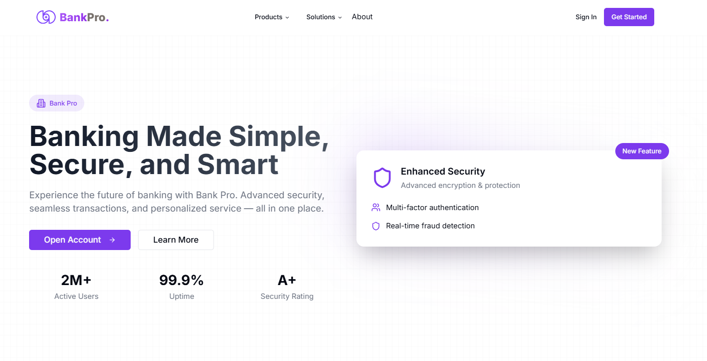

# BankPro - Banking Application



BankPro is a modern and secure banking application built using Next.js. It provides users with a seamless experience for managing their bank accounts, performing transactions, and accessing financial tools online.

## Purpose

The goal of BankPro is to simplify digital banking by offering a user-friendly platform that prioritizes security, reliability, and ease of use. It caters to individuals looking to efficiently manage their finances from any device with an internet connection.

---

## Features

### Core Functionality

1. **User Authentication**

   - Secure login system.
   - Password hashing and storage.
   - Demo credentials available:
     - **Email:** demo@domain.com
     - **Password:** cv8vBgHXxYb8JWu

2. **Dashboard Overview**

   - Displays account balances and recent transactions.

3. **Transactions**

   - Transfer money between accounts.
   - View transaction history.

4. **Account Management**

   - Manage personal details and settings.

5. **Financial Insights**
   - Visual representation of financial data through charts (if implemented).

### Additional Features

- Responsive design for seamless usability on both desktop and mobile devices.
- Built-in error handling and notification system for user feedback.

---

## Setup Instructions

### Prerequisites

Ensure you have the following installed on your machine:

- Node.js (v16 or above)
- npm or yarn
- Git

### Installation

1. Clone the repository:

   ```bash
   git clone https://github.com/eric-ricky/Bank-Pro.git
   cd Bank-Pro
   ```

2. Install dependencies:

   ```bash
   npm install
   # or
   yarn install
   ```

3. Set up environment variables:

   - Create a `.env.local` file in the root directory.
   - Add the necessary environment variables (check `.env.example` for guidance if provided).

4. Start the development server:
   ```bash
   npm run dev
   # or
   yarn dev
   ```
   The application will be available at `http://localhost:3000`.

### Build for Production

To build the application for production:

```bash
npm run build
npm run start
```

### Demo Credentials

You can log in to the demo account using:

- **Email:** demo@domain.com
- **Password:** cv8vBgHXxYb8JWu

---

## Technologies Used

- **Next.js:** Framework for building server-side rendered React applications.
- **React:** Front-end library for building user interfaces.
- **Tailwind CSS:** Utility-first CSS framework for styling.
- **Node.js:** JavaScript runtime environment.
- **API Integration:** For backend communication and data handling.

---

## Contributing

Contributions are welcome! To contribute:

1. Fork the repository.
2. Create a new branch:
   ```bash
   git checkout -b feature-name
   ```
3. Make your changes and commit them:
   ```bash
   git commit -m "Add new feature"
   ```
4. Push to the branch:
   ```bash
   git push origin feature-name
   ```
5. Open a Pull Request.

---

## License

This project is licensed under the MIT License. See the LICENSE file for details.

---

## Author

Developed by [Eric Ricky](https://github.com/eric-ricky). For inquiries, please open an issue or contact via GitHub.
